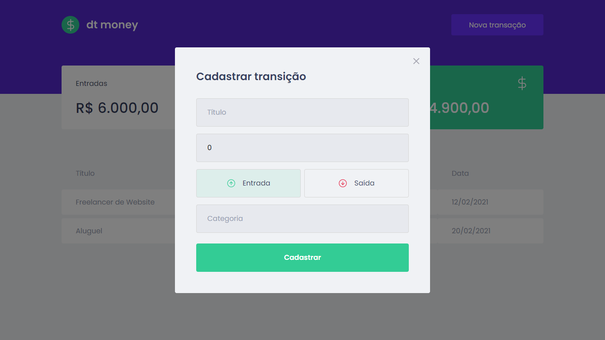
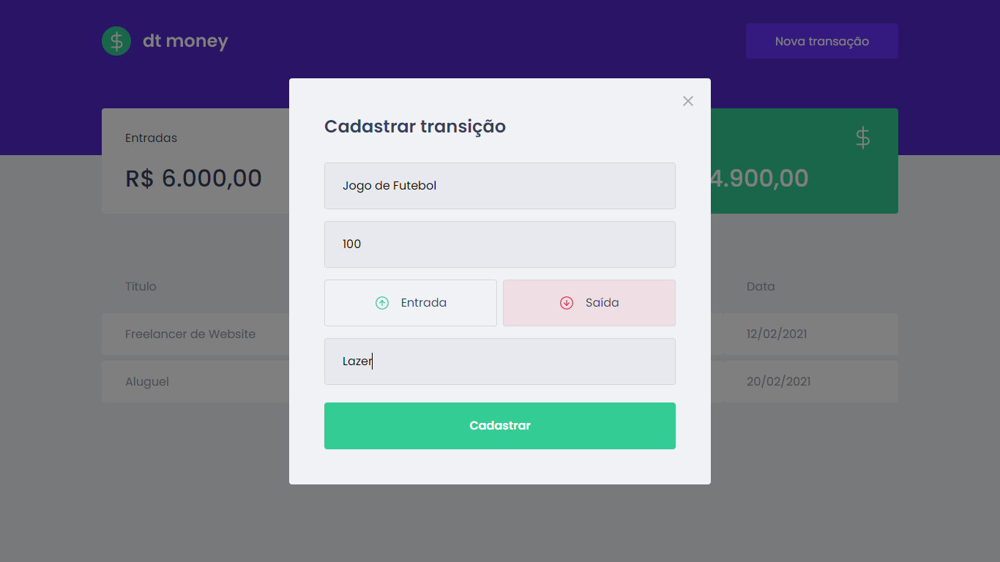
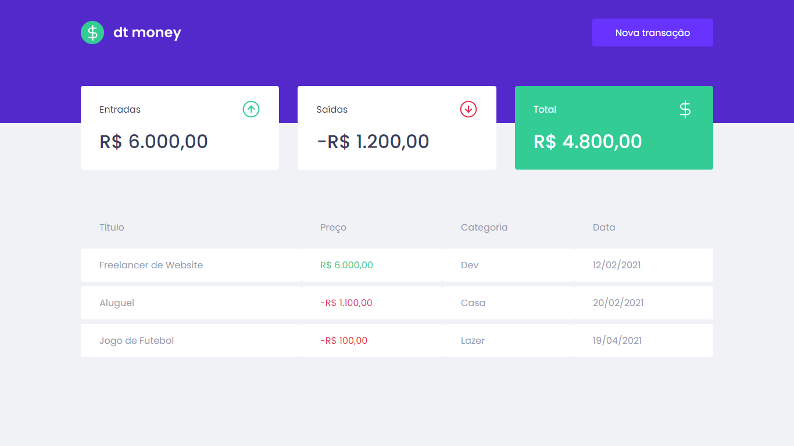

# Ignite DT Money

<p align="center">Projeto desenvolvido no programa Ignite da Rocketseat para Gestão Financeira.</p>

## Tabela de Conteúdo
- [Ignite DT Money](#ignite-dt-money)
  - [Tabela de Conteúdo](#tabela-de-conteúdo)
    - [Features](#features)
    - [Telas](#telas)
    - [Pré-requisitos](#pré-requisitos)
    - [Instalação](#instalação)
    - [Como usar](#como-usar)
    - [Tecnologias e Ferramentas](#tecnologias-e-ferramentas)
    - [Author](#author)

### Features

- [x] Criar repositório
- [x] Desenvolver layout
- [x] Criar contexto para trabalhar com transações
- [x] Desenvolver componentes estilizados
- [x] Criação de fake APIs

### Telas

* Tela Inicial


* Tela de Cadastro



* Cadastro de Saída



* Tela com registro da saída

 

### [Pré-requisitos](#pre-requisitos)

Antes de você começar você irá precisar:

- [Node.js](https://nodejs.org/pt-br/download/) ou [Yarn](https://yarnpkg.com/)
- [Git](https://git-scm.com/)

### [Instalação](#instalacao)

```bash
# Clone do repositório

$ git clone https://github.com/daya-diaz/ignite-dtmoney.git

# Acesse a pasta do projeto no terminal/cmd

$ cd ignite-dtmoney

# Instale as dependências

$ npm install ou yarn
```

### [Como usar](#como-usar)

Este projeto está utilizando [React.js](https://reactjs.org/). Deste modo, para startar o projeto, em ambiente de desenvolvimento, deve-se executar o seguinte comando `npm run start` ou `yarn start`.

### [Tecnologias e Ferramentas](#tecnologias-e-ferramentas)

Este projeto utiliza:

- [React](https://pt-br.reactjs.org/)
- [Typescript](https://www.typescriptlang.org/)
- [Styled-Components](https://styled-components.com/)

### Author

<a href="https://github.com/daya-diaz">
 
 <br />
 <sub><b>Dayane Santos de Melo</b></sub></a> <a href="https://github.com/daya-diaz" title="dayane's">🚀</a>

Feito com ❤ por Dayane Santos 👋🏽 Entre em contato!

* **Instagram** - [@_daysm](https://www.instagram.com/_daysm/)
* **Linkedin** -  [dayane-santos-melo](https://www.linkedin.com/in/dayane-santos-melo/)
* **GitHub** - [daya-diaz](https://github.com/daya-diaz)
